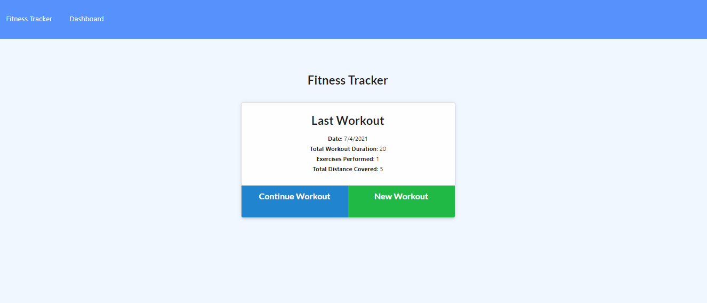
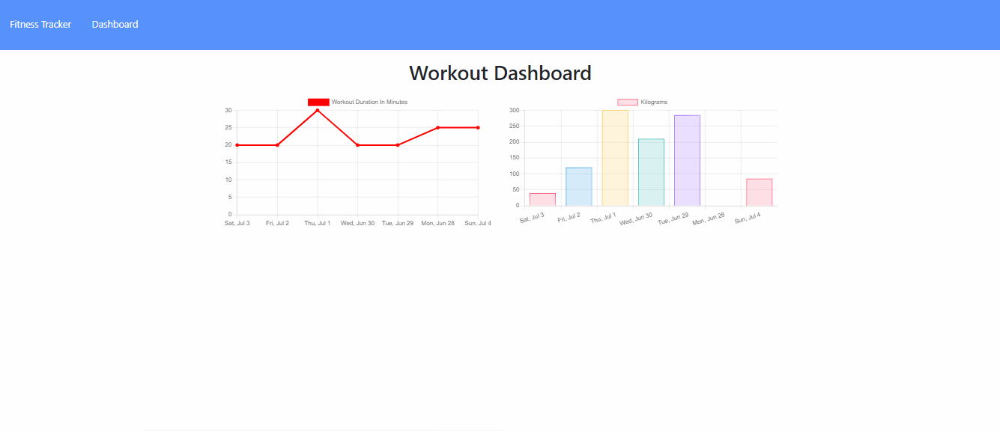
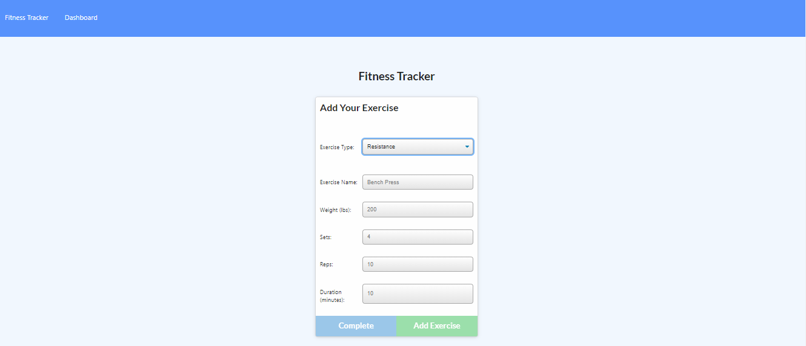
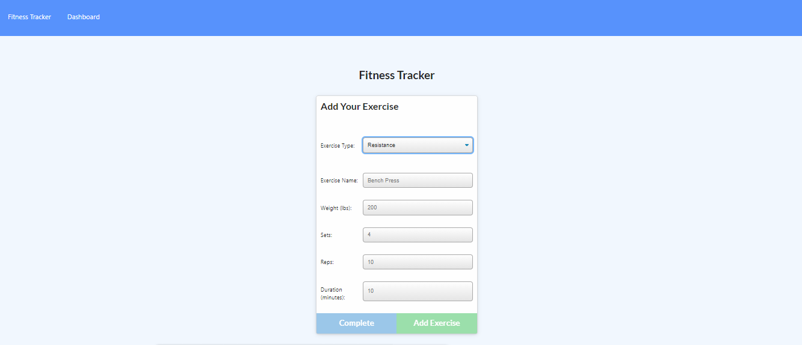

# Workout Tracker

Link to the deployed application can be tested here on Heroku: [Workout Tracker](xxx) and the project repository can be viewed here: [Workout Tracker](https://github.com/mskippen/18-Workout-Tracker.git).

## Description

This is a workout tracker created with Mongo database with a Mongoose schema and handle routes with Express.

## User Story

  As a user, I want to be able to view create and track daily workouts. 
  I want to be able to log multiple exercises in a workout on a given day. 
  I should also be able to track the name, type, weight, sets, reps, and duration of exercise. 
  If the exercise is a cardio exercise, I should be able to track my distance traveled.

## Acceptance Criteria

When the user loads the page, they should are given the option to create a new workout or continue with their last workout.

  The user should be able to:

    * Add exercises to the most recent workout plan.
    * Add new exercises to a new workout plan.
    * View the combined weight of multiple exercises from the past seven workouts on the `stats` page.
    * View the total duration of each workout from the past seven workouts on the `stats` page.

The project should look like this:

## Contact

Megan Skippen <https://github.com/mskippen>

© 2021 Project Agents Pty Ltd. All Rights Reserved.
